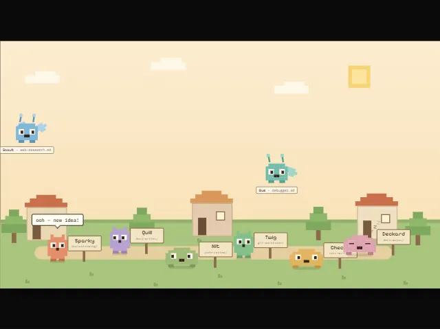

# Skill Village

**Your skills folder… is alive.**

Skill Village is a Tamagotchi-style game for [Claude Code](https://claude.com/claude-code).
Every skill, agent, and project on your machine becomes a pixel creature in a shared village.
You can watch them, talk to them, arrange them by hand, and put one inside a small robot that
speaks out loud.

**Live demo:** [village.fenley.ai](https://village.fenley.ai) — a public copy of the author's
village. No login, nothing to install. It runs a frozen snapshot, so it can lag behind `main`.



## What you get

- **Your files become villagers.** The game reads `~/.claude` and turns every skill and agent
  into a creature. Your projects move in too: each folder under `~/.claude/projects` is a villager
  whose health follows how recently you worked on it, and the skills and agents it uses appear
  beside it.
- **Every creature is unique and stable.** Its body, crown, and colours come from a hash of its
  name. The same skill looks the same on every machine and in every reload. Creatures are pixel
  grids, not image files, so there is no art to download or license.
- **They talk.** Click a villager to chat. Replies come from your own `claude` login on this
  machine, so there are no API keys. A ledger caps what a session can spend.
- **They make sounds.** Voices, footsteps, birds, wind, and music are all synthesized live in the
  browser. Chat babble runs in sync with the spoken reply. There are no audio files.
- **The sky keeps real time.** Six palettes blend from dawn to dusk. Weather is off, picked,
  on a 45-minute journey, or real (your local forecast and sunrise via Open-Meteo). The moon shows
  the true lunar phase.
- **You arrange the village.** Drag a villager anywhere and it stays. The arrangement is saved
  on the server, so it survives reloads and shows on every device.
- **A robot house.** Drag a villager into the house and it speaks through an M5StackChan robot on
  your desk. The `robot-v1` branch adds the audited firmware and a local voice loop (speech to
  text on your PC, text to speech in the cloud).
- **Safe by design.** The server only reads `~/.claude`. It never writes there. All game state
  lives in `~/.skill-village`.

## Run it

Requires Node 20+. For chat, the `claude` CLI must be on your PATH.

```bash
npm install
npm run dev
```

Open http://localhost:5173. If you have no skills or agents yet, the village is an empty field.

Handy URL parameters for testing the sky: `?at=HH:MM&day=sat&weather=storm&palette=1e` sets
the time, day of week, weather mode, and palette directly.

## How it is built

| Package | Role |
|---|---|
| `packages/core` | The shared brain: types, name to appearance, simulation rules, file parsers. Pure functions, no I/O. |
| `packages/server` | One process: state store, file bridge, simulation tick, chat runner, robot shim, REST and WebSocket API. |
| `packages/web` | The [KAPLAY](https://github.com/kaplayjs/kaplay) browser game: sprite compositor, motion, sky, sound, the village scene. Holds no game truth. |

The rule throughout: **everything that decides is a pure function; only the last inch draws.**
Grid composition, motion math, layout, sound direction, and protocol parsing are DOM-free and
covered by the test suite (`npm test`). The KAPLAY glue is thin on purpose.

## Where things stand

Shipped on `main`: the village and its creatures, chat, the sky and weather, the sound engine,
pinning, projects as villagers, the robot house, and a public read-only spectator build.

In flight: the robot voice loop (`robot-v1` branch, waiting on hardware bring-up) and project
care (feeding, releasing, and re-adopting projects).

Next: hatching new skills through an in-character interview, adopting from open-source catalogs,
and training a skill by editing its file with your approval.

## Deploy

- [docs/village-deploy.md](docs/village-deploy.md) — the interactive game on a droplet.
- [docs/showroom-deploy.md](docs/showroom-deploy.md) — the read-only spectator build.

## Design history

The design and execution record lives under [`docs/`](docs/). Start with the
[roadmap](docs/superpowers/specs/2026-08-22-roadmap-reconciliation-design.md). The rest is
reference material: specs, task plans, review records, and session handoffs. You do not need
any of it to run or change the game.

## Credits

Built with [Claude Code](https://claude.com/claude-code), rendered with
[KAPLAY](https://github.com/kaplayjs/kaplay) (MIT). Moon phases from
[`trmnmc/moon`](https://github.com/trmnmc/moon). Type is Pixelify Sans and IBM Plex Mono.
